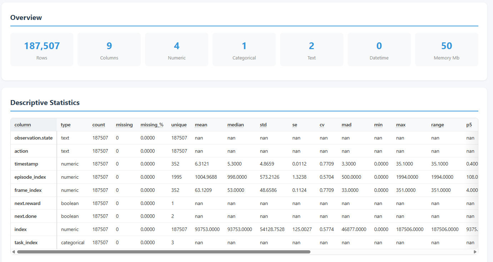
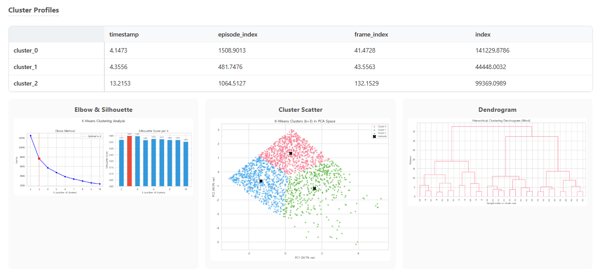

# f2a — File to Analysis

> **One line of code → Full statistical analysis + interactive HTML report.**
> 24+ file formats, HuggingFace datasets, 6 languages, 20+ analysis modules, 50+ visualizations.

[](https://pypi.org/project/f2a/)
[](https://pypi.org/project/f2a/)
[](LICENSE)
[]()

<p align="center">
  
</p>

<p align="center">
  
</p>

<p align="center"><i>Generated from <code>f2a.analyze("lerobot/roboturk")</code> — a single line of code.</i></p>

---

## Live Sample Report

> 📊 **[View Sample Report (lerobot/roboturk)](https://cocoRoF.github.io/f2a/lerobot_roboturk_20260317_090024_report.html)** ← GitHub Pages (recommended)
>
> A fully self-contained interactive HTML report generated from the [lerobot/roboturk](https://huggingface.co/datasets/lerobot/roboturk) dataset.
>
> **Alternative:** [Download raw HTML](https://raw.githubusercontent.com/CocoRoF/f2a/main/sample/lerobot_roboturk_20260317_090024_report.html) and open in your browser.

---

## Installation

```bash
pip install f2a
```

For advanced analyses (UMAP, ADF tests):

```bash
pip install f2a[advanced]
```

---

## Quick Start

```python
import f2a

# ── Local files ──────────────────────────────────────
report = f2a.analyze("data/sales.csv")
report.show()                    # Print summary to console
report.to_html("output/")       # Save interactive HTML report

# ── HuggingFace datasets ────────────────────────────
report = f2a.analyze("https://huggingface.co/datasets/imdb")
report = f2a.analyze("hf://imdb")
report = f2a.analyze("imdb")    # org/dataset pattern auto-detected

# ── Access results ───────────────────────────────────
report.stats.summary             # Descriptive statistics (DataFrame)
report.stats.correlation_matrix  # Correlation matrix
report.stats.advanced_stats      # Advanced analysis results
report.schema.columns            # Column type information
report.to_dict()                 # Everything as a dictionary
```

---

## Example: Analyzing a HuggingFace Dataset

```python
import f2a

report = f2a.analyze("https://huggingface.co/datasets/lerobot/roboturk")
```

```
shape: (187507, 11) | subsets: 1
  default/train: (187507, 11)
```

```python
report.show()
```

```
╔══════════════════════════════════════════════════════════╗
║  f2a Analysis Report — lerobot/roboturk                 ║
╠══════════════════════════════════════════════════════════╣
║  Rows: 187,507  ·  Columns: 11                         ║
║  Numeric: 9  ·  Categorical: 0  ·  Text: 0             ║
║  Datetime: 0  ·  Boolean: 0                             ║
╚══════════════════════════════════════════════════════════╝
```

```python
# Save interactive HTML report (2.5 MB self-contained file)
path = report.to_html("output/")
print(path)
# → output/lerobot_roboturk_20260317_090024_report.html
```

> 📊 **[View this report live](https://cocoRoF.github.io/f2a/lerobot_roboturk_20260317_090024_report.html)**

```python
# Access statistics programmatically
report.stats.summary
#          timestamp   episode_index  frame_index  ...
# count   187507.00      187507.00    187507.00   ...
# mean         ...           ...          ...     ...
# std          ...           ...          ...     ...

report.stats.correlation_matrix
#                   timestamp  episode_index  frame_index  ...
# timestamp          1.000000      0.978193     0.054412  ...
# episode_index      0.978193      1.000000    -0.003887  ...

# Advanced analysis results
report.stats.advanced_stats.keys()
# dict_keys(['advanced_distribution', 'advanced_correlation', 'clustering',
#            'dimreduction', 'feature_insights', 'advanced_anomaly', ...])
```

---

## Multi-Subset HuggingFace Datasets

Datasets with multiple configs and splits are **automatically discovered and analyzed**.

```python
report = f2a.analyze("FINAL-Bench/ALL-Bench-Leaderboard")
print(f"Total: {report.shape[0]} rows across {len(report.subsets)} subsets")

for s in report.subsets:
    print(f"  {s.subset}/{s.split}: {s.shape}")

# Load specific subset
report = f2a.analyze("FINAL-Bench/ALL-Bench-Leaderboard", config="agent", split="train")
```

The HTML report generates **tabbed navigation** — each subset/split gets its own analysis page.

---

## HTML Report Features

`report.to_html()` generates a **single self-contained HTML file** (no external dependencies) with:

### 📑 Two-Depth Tab Navigation

```
[Subset/Split Tabs]
  └── [Basic] | [Advanced]
        ├── Basic: 13 analysis sections
        └── Advanced: 10 advanced analysis sections
```

### 🎯 Interactive Elements

| Feature | Description |
|---|---|
| **Metric Tooltips** | Hover any table header to see a detailed explanation of the metric |
| **Method Info Modals** | Click the ⓘ button on each section to see a detailed beginner-friendly explanation |
| **Image Zoom Modal** | Click any chart to view full-size with zoom/pan/drag support |
| **Draggable Tables** | Wide tables support horizontal drag-scrolling with sticky first column |
| **6-Language i18n** | English, Korean, Chinese, Japanese, German, French — switch in the header |
| **Dark/Light Theme** | Automatic system preference detection + manual toggle |
| **Responsive Layout** | Works on desktop, tablet, and mobile |

### 📖 Beginner-Friendly Descriptions

Every section and every metric includes:
- **Detailed modal descriptions** with HTML formatting, examples, and analogies
- **Beginner tips** (초심자 팁 / Anfänger-Tipp / Conseil débutant / 初心者向けヒント / 初学者提示)
- **Interpretation guidance** — what does this number actually mean?
- All descriptions are **fully translated** into 6 languages (not machine-translated placeholders)

---

## Analysis Modules

### Basic Analysis (13 sections)

| Section | Key Metrics |
|---|---|
| **Overview** | Row/column count, type distribution, memory usage |
| **Data Quality** | Completeness, uniqueness, consistency, validity (0–100%) |
| **Preprocessing** | Applied steps, before/after comparison |
| **Descriptive Statistics** | Mean, median, std, SE, CV, MAD, min/max, quartiles, IQR, skewness, kurtosis |
| **Distribution Analysis** | Shapiro-Wilk, D'Agostino, KS, Anderson-Darling normality tests |
| **Correlation Analysis** | Pearson, Spearman, Kendall matrices, Cramér's V, VIF |
| **Missing Data** | Per-column missing ratio, row distribution, pattern analysis |
| **Outlier Detection** | IQR method, Z-score method, per-column outlier stats |
| **Categorical Analysis** | Frequency, entropy, normalized entropy, chi-square independence |
| **Feature Importance** | Variance ranking, mean absolute correlation, mutual information |
| **PCA** | Explained variance, scree plot, loadings heatmap, biplot |
| **Duplicates** | Exact duplicate rows, column-wise uniqueness |
| **Warnings** | High correlation, high missing ratio, constant columns |

### Advanced Analysis (10 sections)

| Section | Techniques |
|---|---|
| **Advanced Distribution** | Best-fit distribution selection (7 candidates), power transform analysis, Jarque-Bera test, ECDF, KDE bandwidth optimization |
| **Advanced Correlation** | Partial correlation, mutual information matrix, bootstrap confidence intervals, correlation network graph |
| **Clustering** | K-Means (elbow method), DBSCAN, hierarchical clustering (dendrogram), cluster profiling |
| **Dimensionality Reduction** | t-SNE, UMAP (optional), Factor Analysis |
| **Feature Insights** | Interaction detection, monotonic relationships, optimal binning, cardinality analysis, data leakage detection |
| **Anomaly Detection** | Isolation Forest, Local Outlier Factor (LOF), Mahalanobis distance, ensemble consensus |
| **Statistical Tests** | Levene, Kruskal-Wallis, Mann-Whitney U, chi-square goodness-of-fit, Grubbs test, ADF stationarity |
| **Insight Engine** | Auto-generated prioritized natural-language insights |
| **Cross Analysis** | Outlier × cluster intersection, Simpson's paradox detection |
| **ML Readiness** | Multi-dimensional ML-readiness scoring, encoding recommendations, data type suggestions |

---

## Visualizations (50+)

| Category | Charts |
|---|---|
| **Distribution** | Histogram + KDE, boxplots, violin plots, Q-Q plots |
| **Correlation** | Heatmap (Pearson/Spearman/Kendall), partial correlation heatmap, MI heatmap, bootstrap CI plot, network graph |
| **Missing** | Missing matrix, bar chart, heatmap |
| **Outlier** | Box plots with outlier markers, scatter plots |
| **Categorical** | Bar charts, frequency tables |
| **PCA** | Scree plot, cumulative variance, loadings heatmap, biplot |
| **Clustering** | Elbow curve, silhouette plot, cluster scatter, dendrogram, cluster profiles |
| **Advanced Distribution** | ECDF, power transform comparison, KDE bandwidth grid |
| **Dimensionality Reduction** | t-SNE scatter, Factor Analysis loadings |
| **Anomaly** | Isolation Forest scores, LOF scores, Mahalanobis distances, consensus heatmap |
| **Quality** | Radar chart (4 dimensions), per-column quality bars |
| **Insights** | Insight summary cards, cross-analysis Venn diagrams |

All charts are **inline base64 PNG** — no external image files needed.

---

## Supported Formats (24+)

| Category | Formats |
|---|---|
| **Delimited** | `.csv` `.tsv` `.txt` `.dat` `.tab` `.fwf` |
| **JSON** | `.json` `.jsonl` `.ndjson` |
| **Spreadsheet** | `.xlsx` `.xls` `.xlsm` `.xlsb` |
| **OpenDocument** | `.ods` |
| **Columnar** | `.parquet` `.pq` `.feather` `.ftr` `.arrow` `.ipc` `.orc` |
| **HDF5** | `.hdf` `.hdf5` `.h5` |
| **Statistical** | `.dta` (Stata) `.sas7bdat` `.xpt` (SAS) `.sav` `.zsav` (SPSS) |
| **Database** | `.sqlite` `.sqlite3` `.db` `.duckdb` |
| **Pickle** | `.pkl` `.pickle` |
| **Markup** | `.xml` `.html` `.htm` |
| **HuggingFace** | `hf://` URL, full URL, or `org/dataset` pattern |

---

## Configuration

```python
from f2a import AnalysisConfig

# ── Preset configs ───────────────────────────────────
config = AnalysisConfig.fast()        # Skip PCA, feature importance, advanced
config = AnalysisConfig.minimal()     # Descriptive + missing only
config = AnalysisConfig.basic_only()  # All basic on, all advanced off

# ── Custom config ────────────────────────────────────
config = AnalysisConfig(
    advanced=True,
    clustering=True,
    advanced_anomaly=True,
    statistical_tests=True,
    insight_engine=True,
    cross_analysis=True,
    ml_readiness=True,
    outlier_method="zscore",          # "iqr" (default) or "zscore"
    outlier_threshold=3.0,            # Z-score cutoff
    correlation_threshold=0.9,        # High-correlation warning threshold
    pca_max_components=10,
    max_cluster_k=10,                 # Max K for K-Means elbow search
    tsne_perplexity=30.0,
    bootstrap_iterations=1000,
    max_sample_for_advanced=5000,     # Subsample for expensive analyses
)

report = f2a.analyze("data.csv", config=config)
```

### Config Options

| Option | Default | Description |
|---|---|---|
| `descriptive` | `True` | Basic descriptive statistics |
| `distribution` | `True` | Distribution & normality tests |
| `correlation` | `True` | Correlation matrices |
| `outlier` | `True` | Outlier detection |
| `categorical` | `True` | Categorical variable analysis |
| `feature_importance` | `True` | Feature importance ranking |
| `pca` | `True` | PCA analysis |
| `duplicates` | `True` | Duplicate detection |
| `quality_score` | `True` | Data quality scoring |
| `advanced` | `True` | Master toggle for all advanced analyses |
| `advanced_distribution` | `True` | Best-fit distribution, ECDF, power transform |
| `advanced_correlation` | `True` | Partial correlation, MI matrix, bootstrap CI |
| `clustering` | `True` | K-Means, DBSCAN, hierarchical |
| `advanced_dimreduction` | `True` | t-SNE, UMAP, Factor Analysis |
| `feature_insights` | `True` | Interaction & leakage detection |
| `advanced_anomaly` | `True` | Isolation Forest, LOF, Mahalanobis |
| `statistical_tests` | `True` | Levene, Kruskal-Wallis, Grubbs, ADF |
| `insight_engine` | `True` | Auto-generated insights |
| `cross_analysis` | `True` | Cross-dimensional analysis |
| `column_role` | `True` | Column role detection |
| `ml_readiness` | `True` | ML readiness scoring |

---

## API Reference

### `f2a.analyze(source, **kwargs) → AnalysisReport`

| Parameter | Type | Description |
|---|---|---|
| `source` | `str` | File path, URL, or HuggingFace dataset identifier |
| `config` | `AnalysisConfig` | Analysis configuration (optional) |
| `config` | `str` | HuggingFace dataset config/subset name (optional) |
| `split` | `str` | HuggingFace dataset split name (optional) |

### `AnalysisReport`

| Attribute / Method | Type | Description |
|---|---|---|
| `.shape` | `tuple[int, int]` | `(total_rows, columns)` |
| `.schema` | `SchemaInfo` | Column types and metadata |
| `.stats` | `StatsResult` | All statistical results |
| `.stats.summary` | `DataFrame` | Descriptive statistics table |
| `.stats.correlation_matrix` | `DataFrame` | Correlation matrix |
| `.stats.advanced_stats` | `dict` | Advanced analysis results |
| `.subsets` | `list[SubsetReport]` | Per-subset results (multi-subset HF datasets) |
| `.warnings` | `list[str]` | Analysis warnings |
| `.show()` | — | Print summary to console |
| `.to_html(output_dir)` | `Path` | Save interactive HTML report |
| `.to_dict()` | `dict` | Export all results as dictionary |

---

## Project Structure

```
f2a/
├── __init__.py              # Public API: analyze(), AnalysisConfig
├── _version.py
├── core/
│   ├── analyzer.py          # Main analysis orchestrator
│   ├── config.py            # AnalysisConfig dataclass
│   ├── loader.py            # 24+ format data loader
│   ├── preprocessor.py      # Data preprocessing pipeline
│   └── schema.py            # Schema inference
├── stats/                   # 20 analysis modules
│   ├── descriptive.py       # Mean, median, std, quartiles, etc.
│   ├── distribution.py      # Normality tests, skew/kurtosis
│   ├── correlation.py       # Pearson, Spearman, Kendall, VIF
│   ├── missing.py           # Missing data analysis
│   ├── outlier.py           # IQR / Z-score outlier detection
│   ├── categorical.py       # Frequency, entropy, chi-square
│   ├── feature_importance.py
│   ├── pca_analysis.py
│   ├── duplicates.py
│   ├── quality.py           # 4-dimension quality scoring
│   ├── advanced_distribution.py
│   ├── advanced_correlation.py
│   ├── advanced_anomaly.py  # Isolation Forest, LOF, Mahalanobis
│   ├── advanced_dimreduction.py  # t-SNE, UMAP, Factor Analysis
│   ├── clustering.py        # K-Means, DBSCAN, hierarchical
│   ├── feature_insights.py  # Interaction, leakage detection
│   ├── statistical_tests.py # Levene, KW, Mann-Whitney, ADF
│   ├── insight_engine.py    # Auto insight generation
│   ├── cross_analysis.py    # Cross-dimensional analysis
│   ├── column_role.py       # Column role inference
│   └── ml_readiness.py      # ML readiness scoring
├── viz/                     # 15 visualization modules
│   ├── plots.py             # Base plot utilities
│   ├── theme.py             # Consistent theming
│   ├── dist_plots.py
│   ├── corr_plots.py
│   ├── missing_plots.py
│   ├── outlier_plots.py
│   ├── categorical_plots.py
│   ├── pca_plots.py
│   ├── quality_plots.py
│   ├── cluster_plots.py
│   ├── advanced_dist_plots.py
│   ├── advanced_corr_plots.py
│   ├── advanced_anomaly_plots.py
│   ├── dimreduction_plots.py
│   ├── insight_plots.py
│   └── cross_plots.py
├── report/
│   ├── generator.py         # HTML report generator
│   └── i18n.py              # 6-language translations
└── utils/
    ├── exceptions.py
    ├── logging.py
    ├── type_inference.py
    └── validators.py
```

---

## Internationalization (i18n)

The HTML report supports **6 languages** with a language selector in the header:

| Language | Code | Description Quality |
|---|---|---|
| 🇺🇸 English | `en` | Full detailed descriptions with beginner tips |
| 🇰🇷 Korean | `ko` | Full detailed descriptions with 초심자 팁 |
| 🇨🇳 Chinese | `zh` | Full detailed descriptions with 初学者提示 |
| 🇯🇵 Japanese | `ja` | Full detailed descriptions with 初心者向けヒント |
| 🇩🇪 German | `de` | Full detailed descriptions with Anfänger-Tipp |
| 🇫🇷 French | `fr` | Full detailed descriptions with Conseil débutant |

Each language includes:
- **~120 metric tooltip translations** — hover any table header
- **~50 section modal descriptions** — click the ⓘ button on each section
- All UI labels, buttons, and messages

---

## Requirements

- **Python** ≥ 3.10
- **Core**: pandas, numpy, matplotlib, seaborn, scipy, scikit-learn
- **Formats**: datasets (HuggingFace), openpyxl, pyarrow, pyreadstat, tables, odfpy, lxml, duckdb
- **UI**: rich, jinja2
- **Optional**: networkx, umap-learn, statsmodels (install with `pip install f2a[advanced]`)

---

## Development

```bash
# Clone and install
git clone https://github.com/CocoRoF/f2a.git
cd f2a
pip install -e ".[dev]"

# Run tests (88 tests)
pytest git_action/tests/ -q

# Lint
ruff check f2a/
```

---

## License

MIT License — See [LICENSE](LICENSE) for details.
